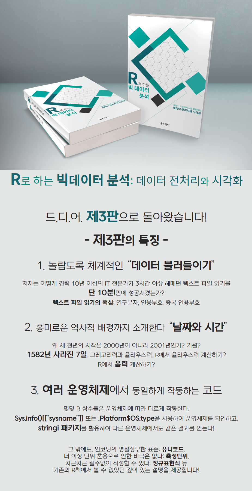

# DAwR03a
R로 하는 빅데이터 분석: 데이터 전처리와 시각화(제3판)



## 표지


## 파일 안내

* `utils.R` : 책에 포함된 여러 함수
  * `u_chars(x)` : 문자열 `x`을 구성하는 문자들에 대한 정보 출력(`Unicode` 패키지 활용).
  * `printlocales()` : 로케일 설정 사항을 보기 좋게 출력
  * `encoding(x) <- "xxx"` : R의 기본 함수인 `Encoding(x) <- "xxx"`는 인코딩을 반영할 수 없을 때에도 아무런 오류를 발생시키지 않는다. `encoding()`의 경우 `Encoding()`과 기능은 동일하지만 만약 적절히 실행이 불가능한 경우에 오류를 발생시킨다.
  
## 사용 방법

```{r}
> source('utils.R', encoding = 'UTF-8')

> u_chars('\ufeff\u132\u67')
        ch codepoint                     label
1 <U+FEFF>      feff ZERO WIDTH NO-BREAK SPACE
2       IJ      0132 LATIN CAPITAL LIGATURE IJ
3        g      ..67      LATIN SMALL LETTER G

> printlocales()
  LC_COLLATE = Korean_Korea.949    
    LC_CTYPE = Korean_Korea.949    
 LC_MONETARY = Korean_Korea.949    
  LC_NUMERIC = C                   
     LC_TIME = Korean_Korea.949 

> x = 'abc'
> Encoding(x)
[1] "unknown"
> encoding(x)
[1] "unknown"
> Encoding(x) = 'cp949'
> encoding(x) = 'cp949'
 Error in `encoding<-`(`*tmp*`, value = "cp949") : 
value %in% c("latin1", "UTF-8", "bytes", "", "unknown") is not TRUE 
```